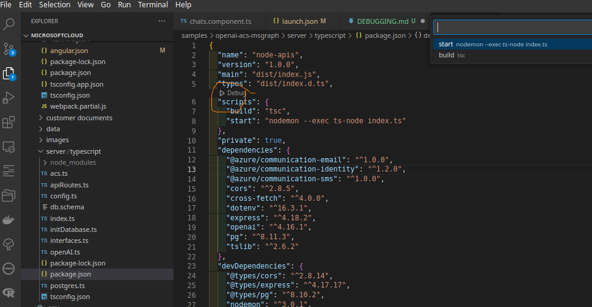
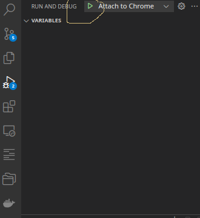
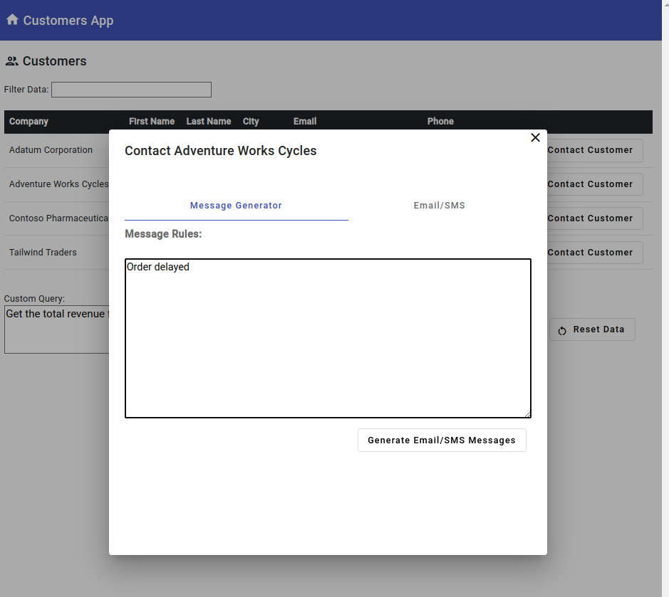
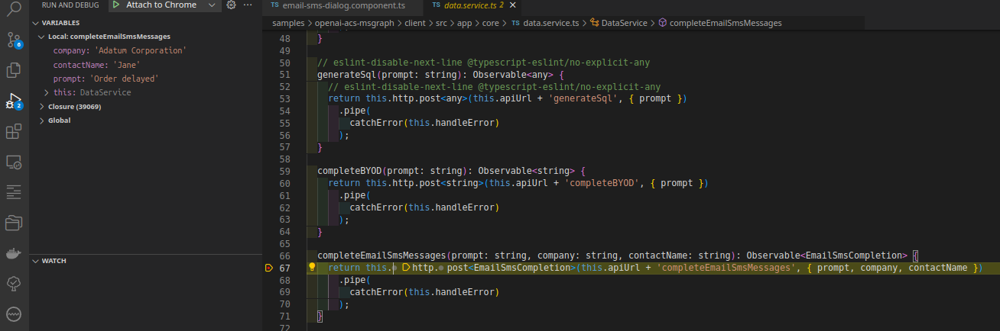
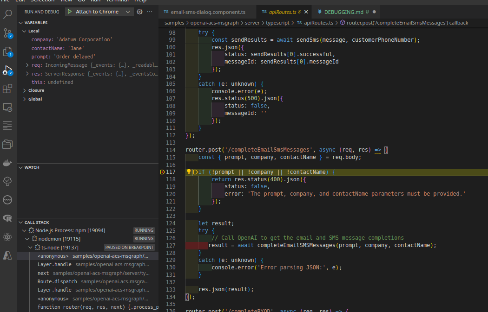

# Debugging (Tested on Ubuntu Linux)
- node/npm must be installed (eg using nvm)
- set the default versions: ``nvm alias default node``


To debug server and client code in VS Code do the following:

## To run the postgres database
1. Launch docker compose from the terminal:
```
cd samples/openai-acs-msgraph
docker compose up # or if using V1 docker-compose up 
```

## To run the server in debug mode
2. Launch the server in debug mode:



 in the package.json of the server 


## To run the server in debug mode
3. Launch the browser in debug mode (here we use chrome):

google-chrome-stable  --remote-debugging-port=9222


4. Modify your launch.json like this:
```
{
  "version": "0.2.0",
  "configurations": [
    {
      "name": "Attach to Chrome",
      "port": 9222,
      "url": "http://localhost:4200/",
      "request": "attach",
      "type": "chrome",
      "webRoot": "${workspaceFolder}/samples/openai-acs-msgraph/client"
    }
  ]
}
```
5. Launch your client from the terminal:
```
cd samples/openai-acs-msgraph/client 
npm start

```

6. Attach client side debugger



## See how the debugger is working

6. 


7. client-side-breakpoint


8. server-side-breakpoint
