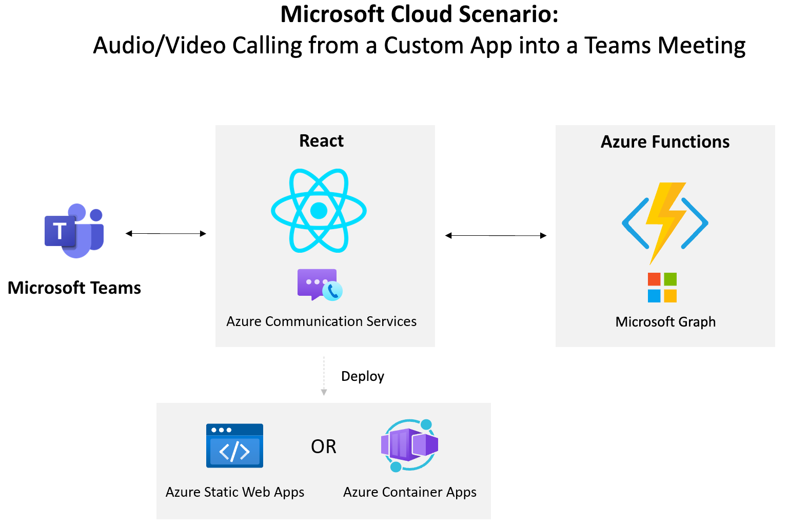

# Audio/Video Call from a Custom App into a Teams Meeting 

## Summary 

This scenario will teach you how to add audio/video calling functionality into a custom application. As users visit your app, they'll be able to make a call directly into a Microsoft Teams Meeting.

Use this type of functionality for:
- Customer service scenarios
- Doctor/patient scenarios
- Student/teacher scenarios
- Help desk scenarios
- More...

Technologies used in this scenario include:
- React
- Azure Communication Services
- Azure Functions
- Microsoft Graph
- Microsoft Teams

## Prerequisites

- [Node](https://nodejs.org)
- [Azure Functions Extension for VS Code](https://marketplace.visualstudio.com/items?itemName=ms-azuretools.vscode-azurefunctions)
- [Azure subscription](https://azure.microsoft.com/free/search)
- [Microsoft 365 developer tenant](https://developer.microsoft.com/microsoft-365/dev-program)

## Setup Steps

To get the solution going you'll need to run the front-end and back-end solutions. 

1. Follow the steps in the `server/typescript` readme file to get the server setup and start it.
1. Follow the steps in the `client` readme file to get the client setup and start it.

## Solution

## References

- Azure Communication Services
- Azure Functions
- Microsoft Graph

## Next Step

