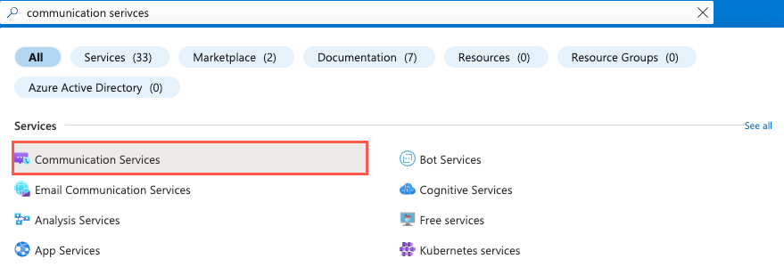
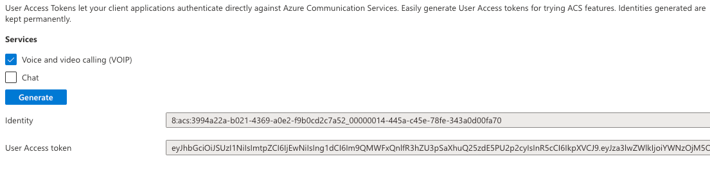
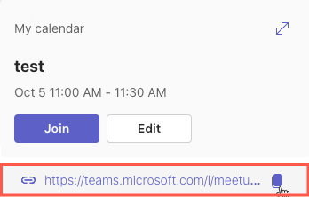

# Lab: ACS Video to Teams Meeting Lab 

Sample Code: /samples/acs-to-teams-meeting

## Exercise 1: Create an Azure Communication Services Resource using the Azure Portal

In this exercise you'll create an Azure Communication Services (ACS) resource in the Azure Portal.

1. Visit https://portal.azure.com in your browser and login.

1. Type `communication services` in the top search bar and select `Communication Services` from the options that appear.


    

1. Select `Create` in the toolbar.

1. Perform the following tasks:
    - Select your subscription.
    - Select the resource group to use (create a new one if needed).
    - Enter an ACS resource name. It must be a unique value.
    - Select a data location.

1. Select `Review + Create` followed by `Create`.

1. Once your ACS resource is created, navigate to it and select `Settings --> Identities & User Access Tokens`.

1. Select the `Voice and video calling (VOIP)` checkbox.

1. Select `Generate`.

1. Copy the `Identity` and `User Access token` values to a local file. You'll need those values later in this exercise.

    

1. Select `Settings --> Keys` and copy the `Primary key` connection string value to the same location as the user identity and token values.

1. To run the application you'll need a Teams meeting link. Go to https://teams.microsoft.com, login with your Microsoft 365 developer tenant, and select the `Calendar` option to the far left. 

1. Select a date/time on the calendar, add a title for the meeting, and select `Save`.

1. Select the new meeting you added in the calendar and copy the Teams meeting link that is displayed into the same file where you stored the ACS user identity, token, and connection string.

    

1. Now that your ACS resource is setup and you have a Teams meeting join link, let's get the React application up and running.

## Exercise 2: Integrate Azure Communication Services Calling into a React App

In this exercise you'll add the [ACS UI calling composite](https://azure.github.io/communication-ui-library/?path=/docs/composites-call-joinexistingcall--join-existing-call) into a React app to enable making audio/video calls from a custom app into a Microsoft Teams meeting.

1. Run the following command to clone this repository to your machine:

    ```bash
    git clone https://github.com/microsoft/MicrosoftCloud
    ```

1. Open the `samples/acs-video-to-teams-meeting/client/react` project folder in Visual Studio Code. 

1. Open the `package.json` file in VS Code and note the following ACS packages are included:

    ```bash
    @azure/communication-common 
    @azure/communication-react
    ``` 

1. Run `npm install` in the `react` folder to install the application dependencies.

1. Open `App.tsx` and take a moment to expore the imports at the top of the file. These handle importing ACS security and calling symbols that will be used in the app.

    ```typescript
    import { 
        AzureCommunicationTokenCredential,
        CommunicationUserIdentifier 
    } from '@azure/communication-common';
    import {  
      CallComposite, 
      fromFlatCommunicationIdentifier, 
      useAzureCommunicationCallAdapter 
    } from '@azure/communication-react';
    import React, { useState, useMemo, useEffect } from 'react';
    import './App.css';
    ```

    > NOTE: You'll see how the `CallComposite` component is used later in this exercise. It provides the core UI functionality for Azure Communication Services to enable making a call from the app into a Microsoft Teams meeting.

1. Locate the `App` component and perform the following tasks:
    - Take a moment to examine the `useState` definitions in the component.
    - Replace the `userId` `useState` function's empty quotes with the ACS user identity value you copied in the previous exercise.
    - Replace the `token` `useState` function's empty quotes with the ACS token value you copied in the previous exercise.
    - Replace the `teamsMeetingLink` `useState` function's empty quotes with the Teams meeting link value you copied in the previous exercise.

    ```typescript
    // Replace '' with the ACS user identity value
    const [userId, setUserId] = useState<string>('');

    // Replace '' with the ACS token value
    const [token, setToken] = useState<string>('');

    // Replace '' with the Teams meeting link value
    const [teamsMeetingLink, setTeamsMeetingLink] = useState<string>('');
    ```

    > NOTE: Later in this tutorial you'll see how to retrieve the `userId` and `token` values dynamically from Azure Communication Services.

1. Take a moment to explore the `useMemo` functions in the `App` component.
    - The `credential` `useMemo` function creates a new `AzureCommunicationTokenCredential` instance once the token has a value.
    - The `callAdapterArgs` `useMemo` function returns an object that has the arguments that are used to make an audio/video call.

    ```typescript
    const credential = useMemo(() => {
        if (token) {
            return new AzureCommunicationTokenCredential(token)
        }
        return;
    }, [token]);

    const callAdapterArgs = useMemo(() => {
        if (userId && credential && displayName && teamsMeetingLink) {
            return {
                userId: fromFlatCommunicationIdentifier(userId) as CommunicationUserIdentifier,
                displayName,
                credential,
                locator: { meetingLink: teamsMeetingLink },
            }
        }
        return {};
    }, [userId, credential, displayName, teamsMeetingLink]);
    ```

    > NOTE: `useMemo` is used in this scenario because we only want the `AzureCommunicationTokenCredential` object and the call adapter args to be created once as the necessary parameters are passed in. View additional details about [useMemo](https://reactjs.org/docs/hooks-reference.html#usememo).

1. Once the `credentials` and `callAdapterArgs` are ready, the following line handles creating an ACS call adapter using the `useAzureCommunicationCallAdapter` hook provided by ACS. The `callAdapter` object will be used later in the UI calling composite component.

    ```typescript
    const callAdapter = useAzureCommunicationCallAdapter(callAdapterArgs);
    ```

    > NOTE: Because `useAzureCommunicationCallAdapter` is a React hook, it won't assign a value to `callAdapter` until the `callAdapterArgs` value is valid.

1. Earlier you assigned the user identity, token, and Teams meeting link to state values in the `App` component. That works fine for now. In a later exercise you'll see how to dynamically retrieve these values. Since you set the values earlier, comment out the entire `useEffect` function:

    ```typescript
    useEffect(() => {
        const init = async () => {
            setMessage('Getting ACS user');
            //Call Azure Function to get the meeting link
            let res = await fetch(process.env.REACT_APP_ACS_USER_FUNCTION as string);
            let user = await res.json();
            setUserId(user.userId);
            setToken(user.token);

            setMessage('Getting Teams meeting link...');
            //Call Azure Function to get the meeting link
            res = await fetch(process.env.REACT_APP_TEAMS_MEETING_FUNCTION as string);
            let link = await res.text();
            setTeamsMeetingLink(link);
            setMessage('');
            console.log('Teams meeting link', link);
        }
        init();
    }, []);
    ```

1. Locate the following JSX code. It uses the `CallComposite` symbol you saw imported to render the user interface used to make an audio/video call from the React app into a Teams meeting. The `callAdapter` you explored earlier is passed to its `adapter` property.

    ```jsx
    if (callAdapter) {
        return (
            <div>
                <h1>Contact Customer Service</h1>
                <div className="wrapper">
                    <CallComposite
                        adapter={callAdapter} 
                    />
                </div>
            </div>
        );
    }
    ```

1. Save the file before continuing.

1. Run `npm start` to run the application. After it builds you should see a calling UI displayed. Enable selecting your microphone and camera and initiate the call. You should see that you're placed in a waiting room. If you join the meeting you setup earlier in Microsoft Teams, you can allow the guest to enter the meeting.

1. Press `ctrl+c` to stop the application. Now that you've successfully run it, let's explore how you can dynamically get the ACS user identity and token and automatically create a Microsoft Teams meeting and return the join URL using Microsoft Graph.

## Exercise 3: Dynamically Create a Microsoft Teams Meeting Link

Circle back to React app and add the fetch call for the teams link

## Exercise 4: Dynamically Create an Azure Communication Services Identity and Token

Circle back to React app and add the fetch call for the ACS user identity/token

